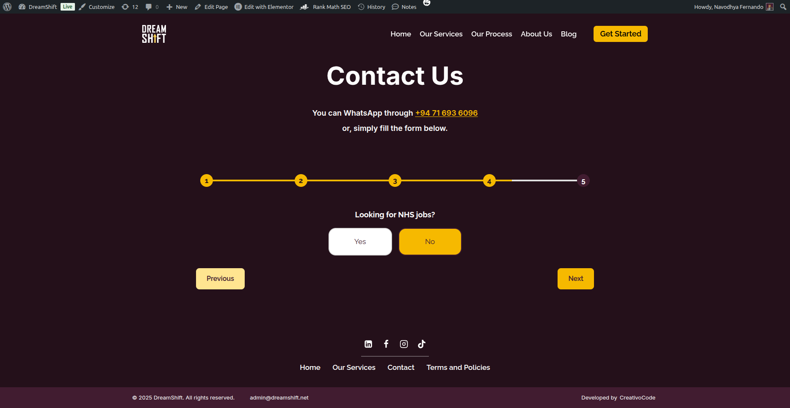

# Dreamshift Contact Forms 🎯

_Serverless, multi-step client onboarding forms for Dreamshift—gateway + follow-up flow with WhatsApp flag picker, geo routing, Calendly handoff, and Google Sheets logging._

[](#)
[](#)
[](#)
[](#)
[](#)
[](#)
[](#)

> **Repo name (suggested):** `dreamshift-careers-intake`  
> **License:** MIT  
> **Description:** Multi-step client intake flow that routes by country, captures lead details, saves to Google Sheets, and hands off to Calendly for booking.

---

## Live URL
**https://dreamshift.net/contact**

---

## Overview
This project improves the **UX for Dreamshift clients** by splitting the flow into:  
1) a **Gateway** (Steps 1–5: Name → Email → WhatsApp (with flag) → LinkedIn (optional) → NHS?), then  
2) a **Country page** (e.g., **contact-lk**, Steps 6–9: Jobs → Locations → Package (+ “Book a call now”) → **Calendly**).

Highlights:
- **WhatsApp with flags** via `intl-tel-input` and **auto country** from IP.
- **Geo-based redirect** (LK/UK/US/AU) using IP, with NHS override.
- **Lottie** “finding the best packages…” animation between flows.
- **Google Sheets** logging via **Apps Script** (GET/POST).
- **Calendly** embed with name/email prefill.

---

## Screenshots

_All images live under `/Demo`. They render on GitHub if this folder exists at the repo root._

### Gateway (Steps 1–5)
| Step | Screenshot |
|---|---|
| 1 — Name |  |
| 2 — Email |  |
| 3 — Phone (WhatsApp with flag) |  |
| 4 — LinkedIn (optional) |  |
| 5 — NHS |  |
| Redirecting (Lottie) |  |

### Country Page (Steps 6–9)
| Step | Screenshot |
|---|---|
| 6 — Jobs applying |  |
| 7 — Locations |  |
| 8 — Packages |  |
| 8 — Package Selected |  |
| 9 — Calendly |  |

---

## Architecture

```
Browser (WordPress + Elementor: Gateway & Country pages)
  ├─ IP lookup (ipapi) → sets:
  │   • WhatsApp flag (intl-tel-input)
  │   • Redirect to LK/UK/US/AU (NHS overrides)
  ├─ Lottie animation during handoff
  ├─ Calendly embed with name/email prefill
  └─ Google Apps Script (Web App) ⇢ Google Sheets (append row)
```

**Libraries**
- [intl-tel-input](https://github.com/jackocnr/intl-tel-input) for country flags & number formatting/validation  
- [Lottie Player](https://lottiefiles.github.io/lottie-player/) for animations  
- [Calendly inline widget](https://help.calendly.com/hc/en-us/articles/226767207-Embed-options-overview) for scheduling

---

## Project Structure

```
/Demo
  Calendly.png
  Email.png
  Jobs-Applying.png
  LinkedIn.png
  Locations.png
  Name.png
  NhsJobs.png
  Package-Selected.png
  Packages.png
  Phone-Number.png
  Redirecting.png
app-script.gs              # Google Apps Script (Web App) → appends rows to Google Sheet
contact-gateway.html       # Steps 1–5 (Name, Email, WhatsApp w/ flags, LinkedIn optional, NHS?) + Lottie handoff
contact-lk.html            # Steps 6–9 for Sri Lanka (Jobs, Locations, Package, Calendly)
contact-uk.html            # Steps 6–9 for UK
contact-us.html            # Steps 6–9 for US
contact-au.html            # Steps 6–9 for AU
contact-nhs.html           # NHS-specific follow-up page (optional)
README.md
```

---

## Quickstart

1. **WordPress / Elementor**
   - Add an HTML widget to the target pages.
   - Paste **`contact-gateway.html`** into the gateway page.
   - Paste **`contact-*.html`** into each country page (LK/UK/US/AU).

2. **Google Sheets (Apps Script)**
   - Create a Google Sheet with columns:  
     `Timestamp | SourcePage | Name | Email | NHSJob | WhatsApp | LinkedIn | Jobs | Locations | Package`
   - Apps Script → Deploy as **Web app** (`Execute as: Me`, `Anyone`).  
   - Copy the **Web App URL**.

3. **Wire the endpoint**
   - In each country page HTML, set:
     ```js
     const GAS_ENDPOINT = 'https://script.google.com/macros/s/XXXXXXXXXXXX/exec';
     ```
   - Save; test the flow end-to-end.
   
4. **Calendly**
   - Set `CALENDLY_URL` in each country page file for prefill.

---

## Configure & Customize

- **Prices**: update `PACKAGE_PRICES` per region in each country file.  
- **Redirect destinations**: in the gateway script, map ISO2 → `/contact-lk`, `/contact-uk`, `/contact-us`, `/contact-au` (NHS → `/contact-nhs`).  
- **Fonts**: Poppins included via Google Fonts.  
- **Placeholders**: `John Doe` etc. can be adjusted in inputs.

---

## Data & Privacy

Captured fields: **Name, Email, NHS?, WhatsApp, LinkedIn, Jobs, Locations, Package**.  
Data is appended to **Google Sheets** via **Apps Script Web App**. IP is used only for country selection and redirect.

---

## Roadmap
- Reusable page template for UK/US/AU with per-country price configs.
- Optional Forminator sink as a fallback.
- Simple admin dashboard to browse/annotate leads.

---

## License
**MIT** — see `LICENSE`.
